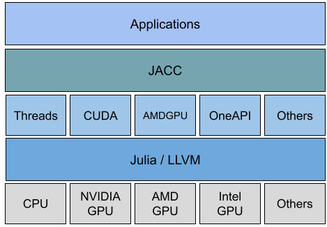

## JACC Introduction
JACC.jl is a Julia package for performance portable CPU/GPU kernels using metaprogramming on top of existing Julia back ends. It enables users to write a single code based on an `array` memory model and `parallel_for` and `parallel_reduce` functions that can run on both CPUs and GPUs without needing to rewrite the code for each platform.

While the [JuliaGPU](https://juliagpu.org/) ecosystem provides powerful tools for GPU programming, JACC leverages these capabilities to simplify the process of writing portable code that can run on both CPUs and GPUs without modification. Hence JACC is complementary to existing solutions in Julia. Users do not need to worry about the underlying hardware and software, or GPU low-level programming concepts. 

*JACC overview*:




Resources:

- For a broader understanding of JACC's design principles and goals, please refer to the [JACC paper at SC-W 2024](https://ieeexplore.ieee.org/document/10820713) - open version [available here](https://conferences.computer.org/sc-wpub/pdfs/SC-W2024-6oZmigAQfgJ1GhPL0yE3pS/555400b955/555400b955.pdf).
- For a full example using JACC, see the Gray-Scott [code](https://github.com/JuliaORNL/GrayScott.jl/blob/main/src/simulation/Simulation.jl#L11) and "Julia for HPC" Tutorial [material](https://juliaornl.github.io/TutorialJuliaHPC/)

!!! why "Why JACC?"

    JACC's default basic APIs enable minimal effort to access CPU and GPU parallel capabilities to accelerate codes and let users focus on their algorithms and science.

## Why Julia?

[Julia](https://julialang.org/) enables scientists and engineers to write code more quickly and to focus on their science or technical domain. 

- Julia combines high-level/low-level capabilities for easy to read and write code due to its expressive mathematical syntax (e.g. arrays, GPU programming, parallelization). 
- Julia's just-in-time (JIT) compilation based on LLVM allows for speeds comparable to C, C++ or Fortran.
- Julia's unified package manager, [Pkg.jl](https://github.com/JuliaLang/Pkg.jl), simplifies the process of managing dependencies.
- Julia's rich ecosystem includes a wide range of libraries and tools for scientific computing, data analysis, and machine learning.


## Supported backends

- **CPU (default)**:
  - `Threads`: multi-threading on CPU using Julia's built-in threading capabilities.
- **GPU from [JuliaGPU](https://juliagpu.org/)**:
  - `CUDA`: NVIDIA GPUs using the [CUDA.jl](https://github.com/JuliaGPU/CUDA.jl) package.
  - `AMDGPU`: AMD GPUs using the [AMDGPU.jl](https://github.com/JuliaGPU/AMDGPU.jl) package.
  - `oneAPI`: Intel GPUs using the [oneAPI.jl](https://github.com/JuliaGPU/oneAPI.jl) package (Experimental).

## Installation

JACC is a registed Julia package. Install JACC using Julia's [Pkg.jl](https://pkgdocs.julialang.org/dev/managing-packages/#Managing-Packages) capabilities for managing packages. 
e.g.

```
pkg> add JACC
```

## Quick start - filling and reducing an array

Prerequisite: 
- [Julia 1.11 or later](https://julialang.org/downloads/)

To run an example from scratch

- Install JACC.jl

```bash
julia -e 'using Pkg; Pkg.add("JACC")'
```

- Copy this file to your local machine and save it as `jacc-saxpy.jl`:

```julia
import JACC
JACC.@init_backend

function axpy(i, alpha, x, y)
    @inbounds x[i] += alpha * y[i]
end

N = 100_000
alpha = 2.0
x = JACC.zeros(Float64, N)
y = JACC.array(fill(Float32(5), N))
JACC.parallel_for(N, axpy, alpha, x, y)
a = JACC.parallel_reduce(x)
println("Result: ", a)
```

- Run the example using the default Threads back end with 4 threads:

```bash
julia -t 4 jacc-saxpy.jl
```

- Switch to another back end, e.g. assuming access to NVIDIA GPU and that CUDA is installed and configured:

```bash
julia -e 'using JACC; JACC.set_backend("CUDA")'
```

!!! note

    This step might take a while the first time downloading all CUDA.jl dependencies. After installation please refer to CUDA.jl docs if wanting to [use a local CUDA installation](https://cuda.juliagpu.org/stable/installation/overview/#Using-a-local-CUDA).

- Run the example again, but this time the same code will run on the GPU:

```bash
julia jacc-saxpy.jl
```
